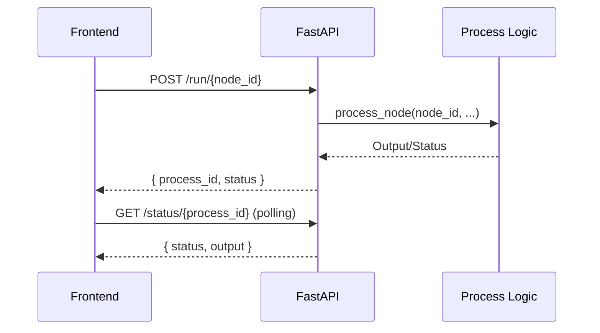
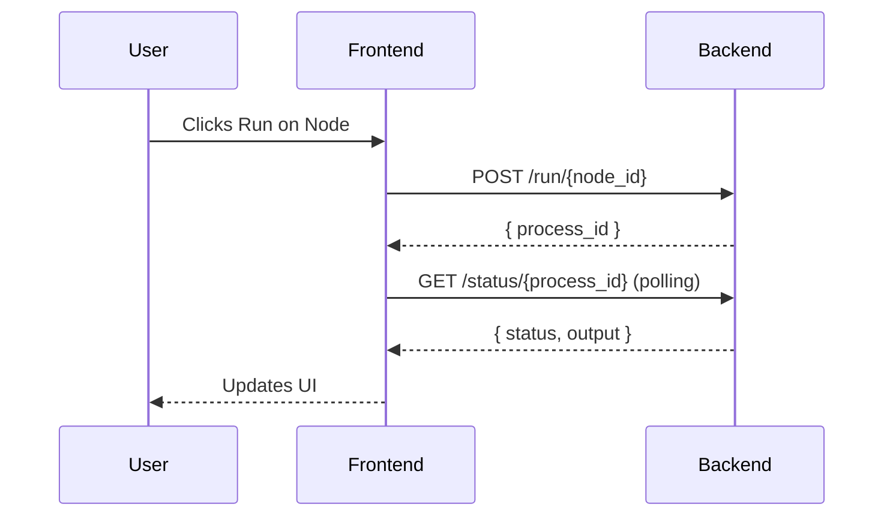
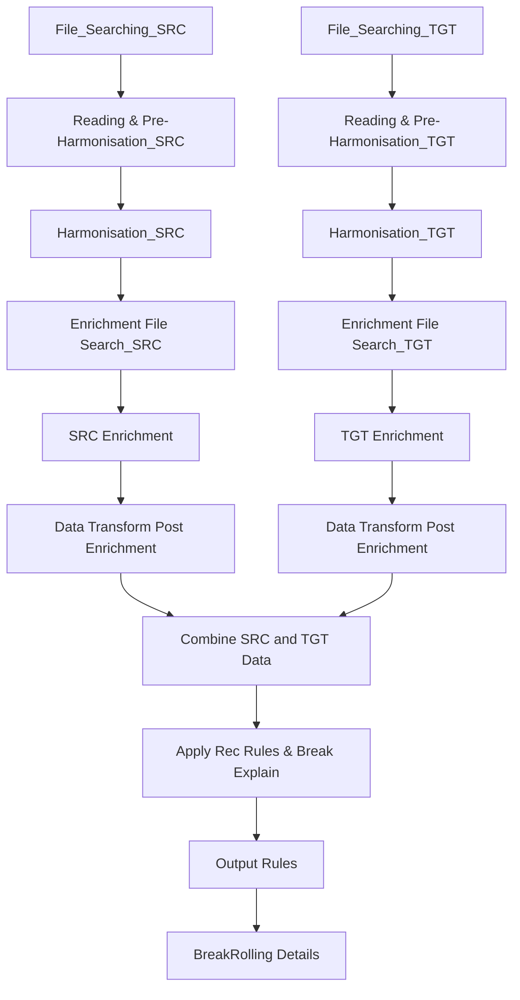

# Dashboard Codebase Documentation

---

## Table of Contents
1. [Project Overview & Architecture](#project-overview--architecture)
2. [Frontend (Next.js) Flow](#frontend-nextjs-flow)
    - [Main Entry Points](#main-entry-points)
    - [ReactFlow Usage](#reactflow-usage)
    - [Node/Edge Setup and Rendering](#nodeedge-setup-and-rendering)
    - [User Interactions](#user-interactions)
    - [API Calls and State Management](#api-calls-and-state-management)
    - [CSS and UI Customization](#css-and-ui-customization)
3. [Backend (FastAPI) Flow](#backend-fastapi-flow)
    - [API Endpoints](#api-endpoints)
    - [Process Management](#process-management)
    - [Node Logic and Async Tasks](#node-logic-and-async-tasks)
    - [Error Handling](#error-handling)
4. [How Everything Connects](#how-everything-connects)
    - [Sequence Diagrams](#sequence-diagrams)
    - [Trigger Chains](#trigger-chains)
5. [How to Make Changes](#how-to-make-changes)
    - [CSS/Styling](#cssstyling)
    - [Adding Nodes/Edges](#adding-nodesedges)
    - [Extending Backend Logic](#extending-backend-logic)
6. [Key Code Snippets with Comments](#key-code-snippets-with-comments)
7. [Full Flow Diagrams](#full-flow-diagrams)
8. [Glossary of Terms](#glossary-of-terms)
9. [How to Get Help/Extend Further](#how-to-get-helpextend-further)

---

## Project Overview & Architecture

This project is a **dashboard application** with a Next.js (React) frontend and a FastAPI backend. It visualizes and manages a data processing pipeline using a node/edge graph. Each node represents a processing step, and edges represent dependencies.

**Architecture Diagram:**

```mermaid
graph TD
    subgraph Frontend (Next.js)
        A[ReactFlow UI] --> B[API Service]
    end
    subgraph Backend (FastAPI)
        C[API Endpoints] --> D[Process Logic]
    end
    B -- HTTP/JSON --> C
```
*Figure 1: High-level architecture of the dashboard application.*

- **Frontend:** Renders the graph, handles user actions, and communicates with the backend.
- **Backend:** Manages process state, runs node logic, and responds to API calls.

---

## Frontend (Next.js) Flow

### Main Entry Points
- **`app/controls/completeness/page.tsx`**: Main dashboard page. Sets up the graph, nodes, edges, and all UI logic.
- **`app/services/api.ts`**: Handles all API calls to the backend.
- **`app/utils/graph-utils.ts`**: Utility functions for graph dependencies and execution order.

### ReactFlow Usage
- Uses [ReactFlow](https://reactflow.dev/) to render and manage the node graph.
- Nodes and edges are defined in arrays (`initialNodes`, `initialEdges`).
- Custom node rendering is handled by the `CustomNode` component.

### Node/Edge Setup and Rendering

**Node Example:**
```ts
{
    id: 'file_searching_src',
    type: 'custom',
    data: { fullName: 'File_Searching_SRC', status: 'idle' },
    position: { x: 300, y: 80 },
    draggable: false
}
```
- `id`: Unique identifier for the node.
- `type`: Node type (custom for our UI).
- `data`: Contains display name and status.
- `position`: Where the node appears on the canvas.

**Edge Example:**
```ts
{
    id: 'file-search-to-pre-harmonisation-src',
    source: 'file_searching_src',
    target: 'pre_harmonisation_src',
    sourceHandle: 'file_searching_src-source',
    targetHandle: 'pre_harmonisation_src-target',
    animated: false,
    style: { stroke: '#1e293b', strokeWidth: 2 }
}
```
- `source`/`target`: Node IDs this edge connects.
- `style`: Color and thickness.

### User Interactions
- **Run**: Starts a node's process (calls backend, updates status, polls for completion).
- **Stop**: Stops a running process.
- **Reset**: Resets a node and all downstream nodes.

**How it works:**
- Clicking a button triggers a handler (e.g., `runNode`), which calls the API and updates state.

### API Calls and State Management
- All API calls are in `app/services/api.ts`.
- Example:
```ts
static async startCalculation(input: CalculationInput): Promise<{ process_id: string }> {
    const response = await fetch(`${API_BASE_URL}/run/${input.nodeId}`, {
        method: 'POST',
        headers: { 'Content-Type': 'application/json' },
        body: JSON.stringify(input),
    });
    if (!response.ok) throw new Error(`Failed to start calculation for node ${input.nodeId}`);
    return response.json();
}
```
- State is managed with React hooks (`useState`, `useEffect`, etc.).

### CSS and UI Customization
- Most styles are inlined or use Tailwind CSS classes.
- To change node/edge appearance, edit the `styles` object or classNames in `page.tsx`.
- Example:
```ts
const styles = {
    selectedNode: {
        border: '2px solid #10b981',
        boxShadow: '0 0 0 2px rgba(16, 185, 129, 0.2)',
        transform: 'scale(1.02)',
        transition: 'all 0.2s ease'
    },
    hoveredNode: {
        border: '2px solid #10b981',
        boxShadow: '0 0 0 2px rgba(16, 185, 129, 0.1)',
        transform: 'scale(1.01)',
        transition: 'all 0.2s ease'
    }
};
```
- For global styles, edit `globals.css` or Tailwind config.

**Frontend Component Flow:**
```mermaid
graph TD
    A[page.tsx (Dashboard Page)] --> B[initialNodes/initialEdges]
    A --> C[CustomNode Component]
    A --> D[ApiService (API Calls)]
    A --> E[graph-utils.ts (Dependency Logic)]
    C --> F[Run/Stop/Reset Buttons]
    D --> G[Backend API]
```
*Figure 2: Main flow of frontend components and their interactions.*

---

## Backend (FastAPI) Flow

### API Endpoints
- **`/run/{node_id}`**: Starts a process for a node.
- **`/status/{process_id}`**: Gets the status of a process.
- **`/stop/{process_id}`**: Stops a process.
- **`/reset/{process_id}`**: Resets a process.
- **`/health`**: Health check.

### Process Management
- Each node run creates a process with a unique ID.
- Processes are tracked in a dictionary (`processes`).
- Async tasks are managed with `asyncio`.

### Node Logic and Async Tasks
- Each node type has a handler function (e.g., `process_file_search_node`).
- The main dispatcher is:
```py
def process_node(node_id: str, params: RunParameters, previous_outputs: Optional[Dict[str, Any]] = None) -> Dict:
    if node_id == "reading_config_comp":
        return process_config_comp_node(params)
    elif node_id == "file_searching_src":
        return process_file_search_node(params, previous_outputs, "src")
    # ...
    else:
        return process_generic_node(params)
```
- Each handler simulates or performs the node's logic and returns output.

### Error Handling
- All exceptions are caught and logged.
- Errors are returned in the API response.

**Backend Request Flow:**

*Figure 3: Backend request and process flow.*

---

## How Everything Connects

### Sequence Diagrams

*Figure 4: User interaction and system response sequence.*

### Trigger Chains
- **User clicks Run** → `runNode` in frontend → `ApiService.startCalculation` → `/run/{node_id}` in backend → `process_node` → handler function
- **Node completes** → status polled by frontend → UI updates
- **Reset** → `ApiService.resetProcess` → `/reset/{process_id}`

---

## How to Make Changes

### CSS/Styling
- Edit styles in `page.tsx` for node/edge appearance.
- Use Tailwind classes or inline styles.
- For global changes, edit `globals.css`.

### Adding Nodes/Edges
- Add to `initialNodes` and `initialEdges` arrays in `page.tsx`.
- Give each node a unique `id` and set its `position`.
- Add a handler in the backend if it needs custom logic.

### Extending Backend Logic
- Add a new handler function in `main.py`.
- Update `process_node` to dispatch to your new handler.

---

## Key Code Snippets with Comments

### Frontend: Running a Node
```ts
// Triggers when user clicks Run
const runSingleNode = async (nodeId: string) => {
    // Check if parameters are applied
    if (!areParamsApplied) return;
    // Get parameters from localStorage
    const params = JSON.parse(localStorage.getItem('validatedParams'));
    // Prepare request
    const request = {
        nodeId,
        parameters: params,
        previousOutputs: nodeOutputs,
        timestamp: new Date().toISOString()
    };
    // Call backend to start calculation
    const response = await ApiService.startCalculation(request);
    // Poll for status
    const pollInterval = setInterval(async () => {
        const status = await ApiService.getProcessStatus(response.process_id);
        if (status.status === 'completed' || status.status === 'failed') {
            clearInterval(pollInterval);
            updateNodeStatus(nodeId, status.status);
            // Save output if completed
            if (status.status === 'completed' && status.output) {
                setNodeOutputs(prev => ({ ...prev, [nodeId]: status.output }));
            }
        }
    }, 1000);
};
```

### Backend: Node Dispatcher
```py
# Dispatches to the correct node handler based on node_id
def process_node(node_id: str, params: RunParameters, previous_outputs: Optional[Dict[str, Any]] = None) -> Dict:
    if node_id == "reading_config_comp":
        return process_config_comp_node(params)
    elif node_id == "file_searching_src":
        return process_file_search_node(params, previous_outputs, "src")
    # ...
    else:
        return process_generic_node(params)
```

---

## Full Flow Diagrams

**Overall Data Pipeline Flow:**

*Figure 5: Full data pipeline flow as visualized in the dashboard.*

---

## Glossary of Terms
- **Node**: A step in the data pipeline.
- **Edge**: A connection/dependency between nodes.
- **Process**: An instance of a node's execution.
- **Handler**: Backend function that implements node logic.
- **ReactFlow**: Library for rendering node graphs.

---

## How to Get Help/Extend Further
- Read the comments in the code for guidance.
- Use this documentation as a reference for file/function purposes.
- For more, see [ReactFlow docs](https://reactflow.dev/) and [FastAPI docs](https://fastapi.tiangolo.com/).

---

# End of Documentation 